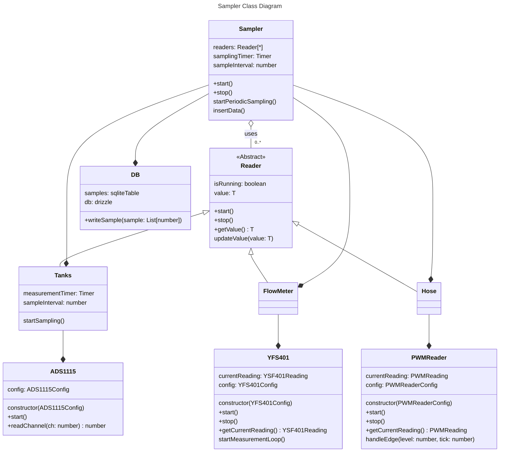

```mermaid
---
title: Sampler Class Diagram
---
classDiagram
class ADS1115 {
    config: ADS1115Config
    constructor(ADS1115Config)
    +start()
    +readChannel(ch: number) number
}

class PWMReader {
    currentReading: PWMReading
    config: PWMReaderConfig
    constructor(PWMReaderConfig)
    +start()
    +stop()
    +getCurrentReading() PWMReading
    handleEdge(level: number, tick: number)
}

class YFS401 {
    currentReading: YSF401Reading
    config: YFS401Config
    constructor(YFS401Config)
    +start()
    +stop()
    +getCurrentReading() YSF401Reading
    startMeasurementLoop()
}

class Sampler {
    readers: Reader[*]
    samplingTimer: Timer
    sampleInterval: number
    +start()
    +stop()
    startPeriodicSampling()
    insertData()
}
class Tanks {
    measurementTimer: Timer
    sampleInterval: number
    startSampling()
}

class FlowMeter

class Hose

class Reader {
    <<Abstract>>
    isRunning: boolean
    value: T
    +start()
    +stop()
    +getValue() T
    updateValue(value: T)
}

class DB {
    samples: sqliteTable
    db: drizzle
    +writeSample(sample: List[number])
}


Tanks --* ADS1115
FlowMeter --* YFS401
    Hose --* PWMReader
    Reader <|-- Tanks
    Reader <|-- FlowMeter
    Reader <|-- Hose
%%    Tanks --|> Reader
%%    FlowMeter --|> Reader
%%    Hose --|> Reader
    

Sampler --* Tanks
Sampler --* FlowMeter
Sampler --* Hose
Sampler --* DB
Sampler o--"0..*" Reader : uses

```