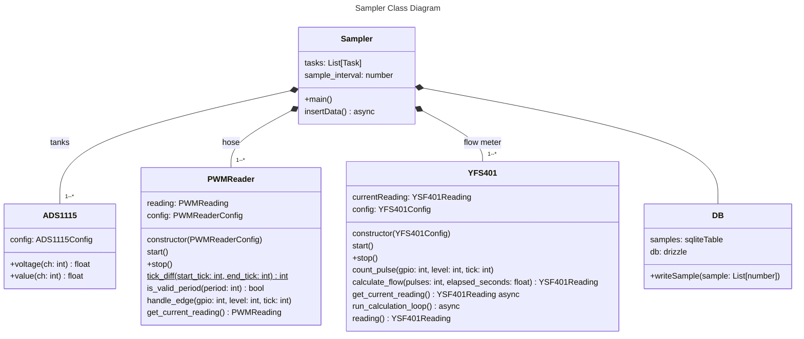

```mermaid
---
title: Sampler Class Diagram
---
classDiagram
class ADS1115 {
    config: ADS1115Config
    +voltage(ch: int) float
    +value(ch: int) float
}

class PWMReader {
    reading: PWMReading
    config: PWMReaderConfig
    constructor(PWMReaderConfig)
    start()
    +stop()
    tick_diff(start_tick: int, end_tick: int) int$
    is_valid_period(period: int) bool
    handle_edge(gpio: int, level: int, tick: int)
    get_current_reading() PWMReading
}

class YFS401 {
    currentReading: YSF401Reading
    config: YFS401Config
    constructor(YFS401Config)
    start()
    +stop()
    count_pulse(gpio: int, level: int, tick: int)
    calculate_flow(pulses: int, elapsed_seconds: float) YSF401Reading
    get_current_reading() YSF401Reading async
    run_calculation_loop() async
    reading() YSF401Reading
}


class Sampler {
    tasks: List[Task]
    sample_interval: number
    +main()
    insertData() async
}


class DB {
    samples: sqliteTable
    db: drizzle
    +writeSample(sample: List[number])
}


%%    Tanks --|> Reader
%%    FlowMeter --|> Reader
%%    Hose --|> Reader
    

Sampler *--"1--*" ADS1115 : tanks
Sampler *--"1--*" PWMReader: hose
Sampler *--"1--*" YFS401: flow meter
Sampler *-- DB

```