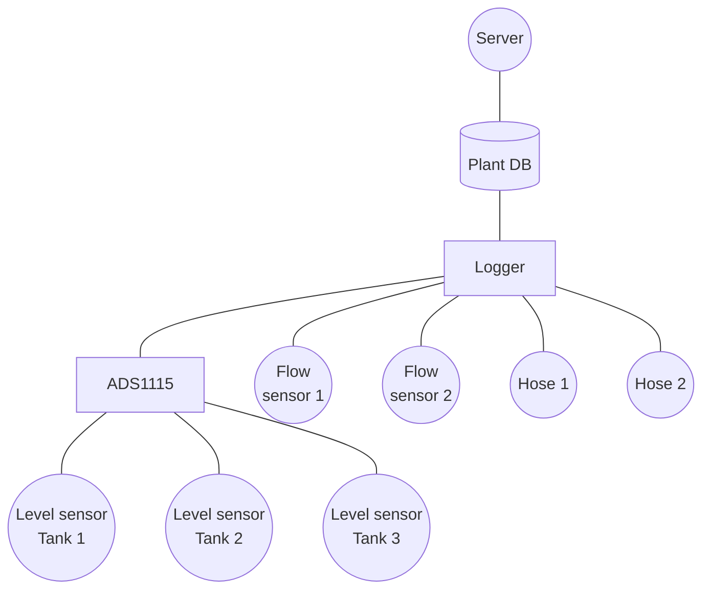

```mermaid
graph TB
    %% The system
    A[ADS1115]
    B[Logger]
    C[(Plant DB)]

    %% External entities
    AE((Level sensor 
        Tank 1))
    BE((Level sensor 
        Tank 2))
    CE((Level sensor 
        Tank 3))

    DE((Flow 
        sensor 1))
    EE((Flow 
        sensor 2))

    FE((Hose 1))
    GE((Hose 2))

    HE((Server))

    %% Connections
    A --- AE
    A --- BE
    A --- CE

    B --- A
    B --- DE
    B --- EE
    B --- FE 
    B --- GE

    C --- B
    HE --- C
```